# ✅ ToDoList App – Spring Boot + Thymeleaf

Aplicação web de lista de tarefas (ToDo List) com autenticação de usuários, frontend responsivo com Thymeleaf + Bootstrap e suporte a tema escuro.

---

## 📚 Tecnologias usadas

- Java 21
- Spring Boot 3
- Spring Data JPA
- Spring Security
- PostgreSQL
- Thymeleaf
- Bootstrap 5 + Bootstrap Icons
- HTML, CSS e JavaScript
- Git + GitHub

---

## 🚀 Funcionalidades

- ✅ Cadastro e login de usuários
- ✅ CRUD de tarefas (criar, listar, editar, excluir)
- ✅ Responsividade para desktop, tablet e mobile
- ✅ Tema escuro manual com botão de alternância
- ✅ Ícones com Bootstrap Icons
- ✅ Página de erro personalizada
- ✅ Segurança com criptografia de senha (BCrypt)
- ✅ Versionado com Git e pronto para deploy

---

## 📷 Screenshots
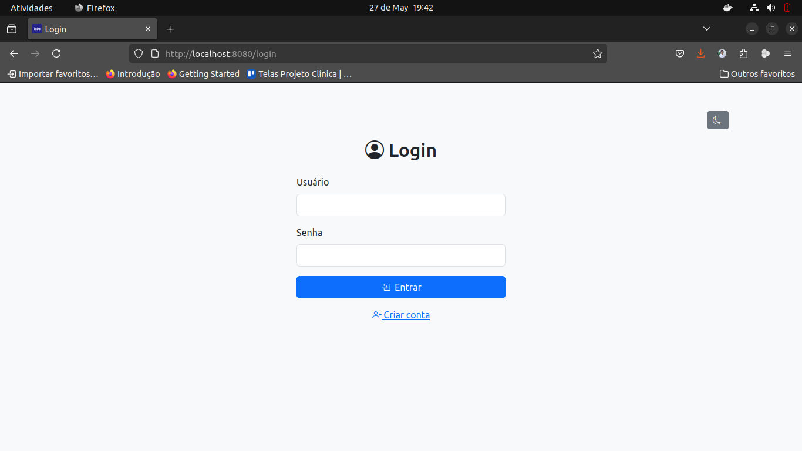
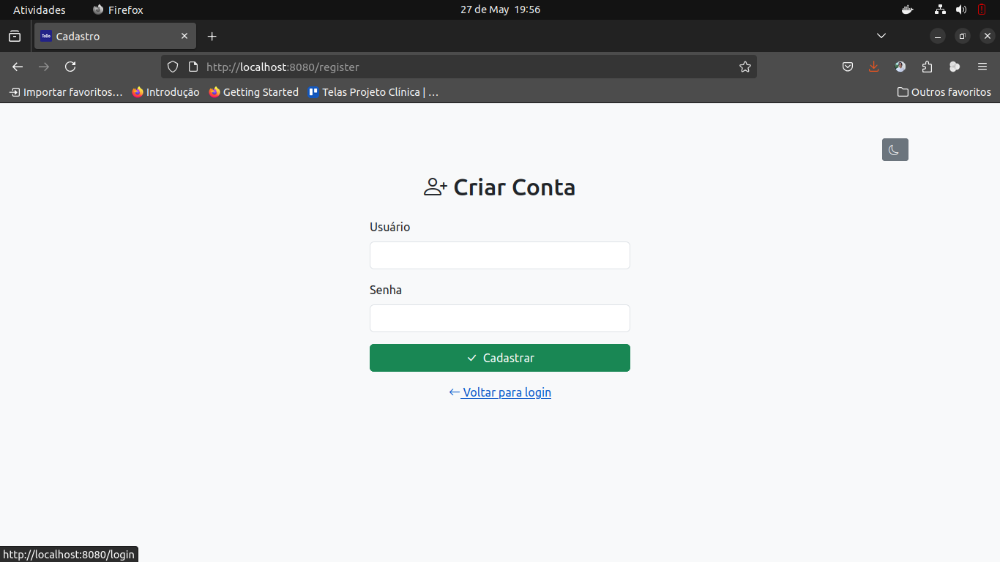
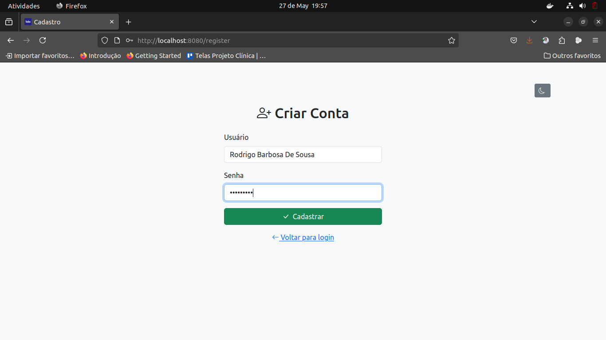
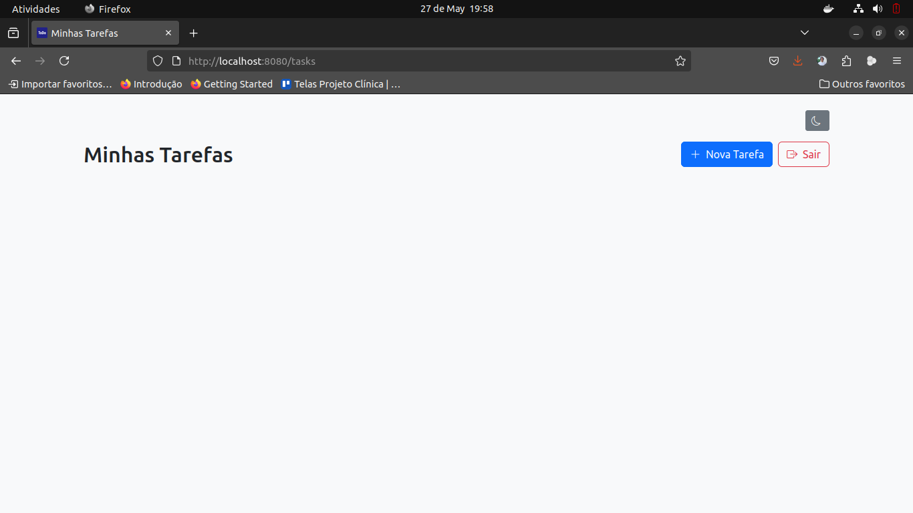
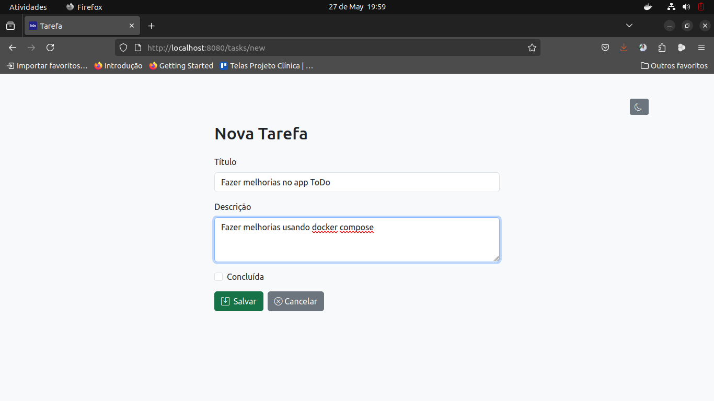
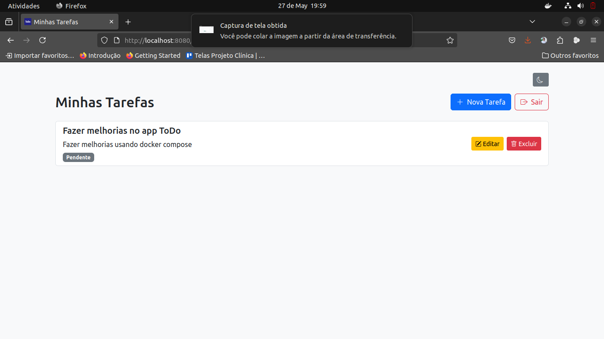
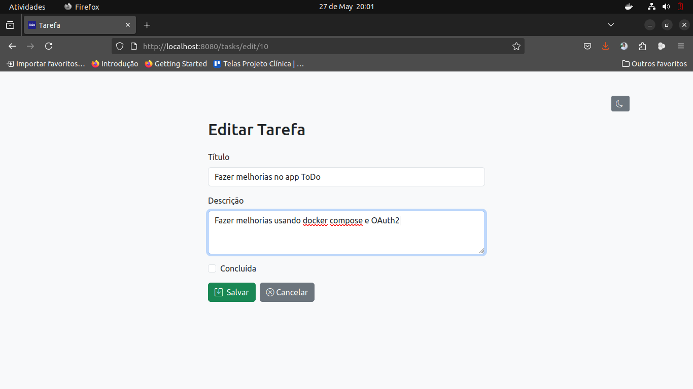
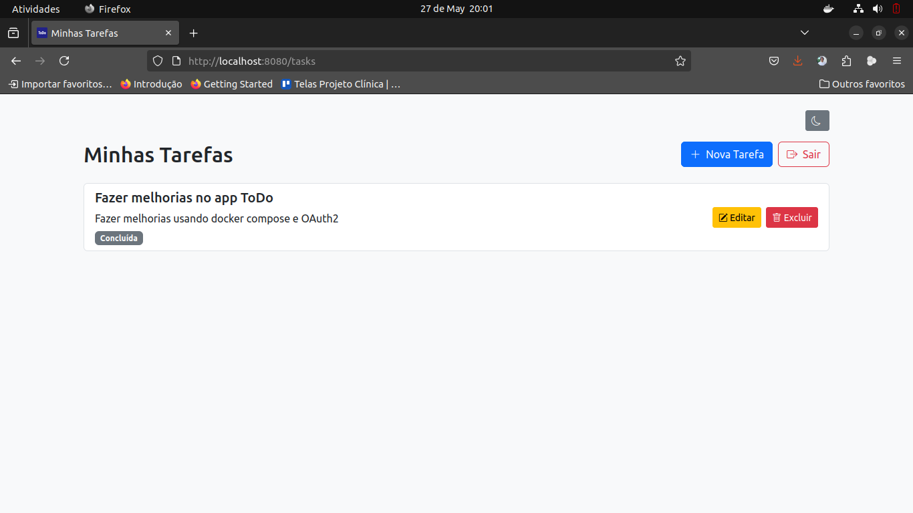

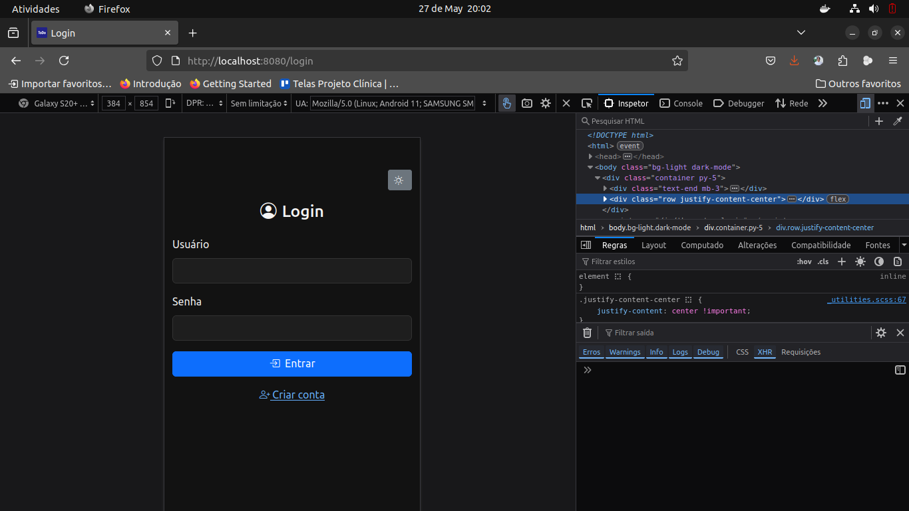
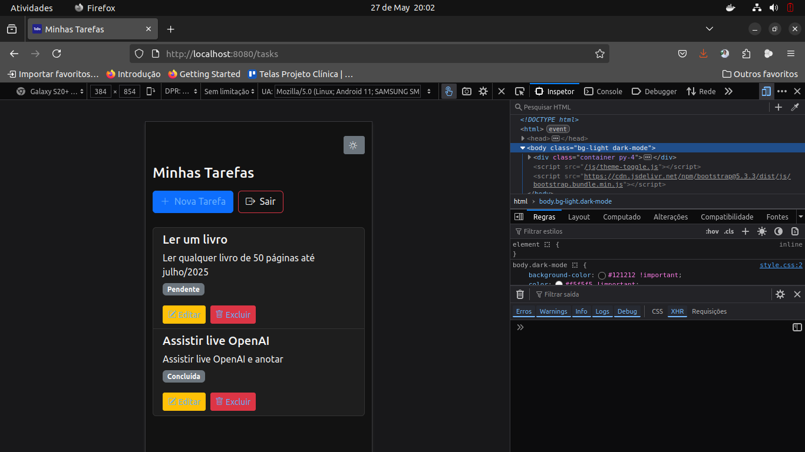
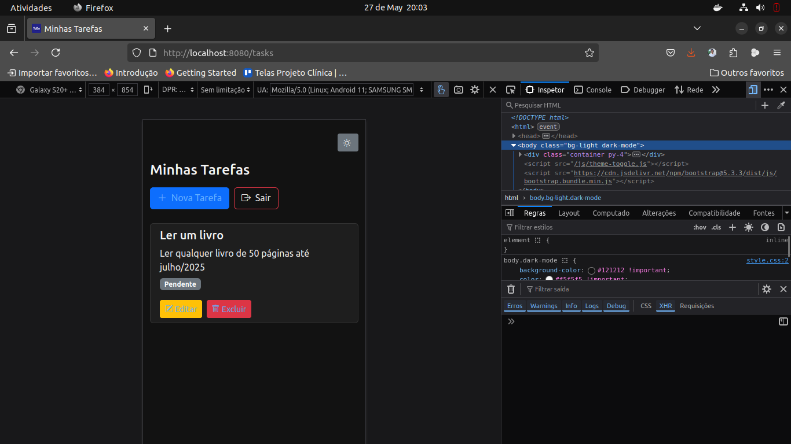
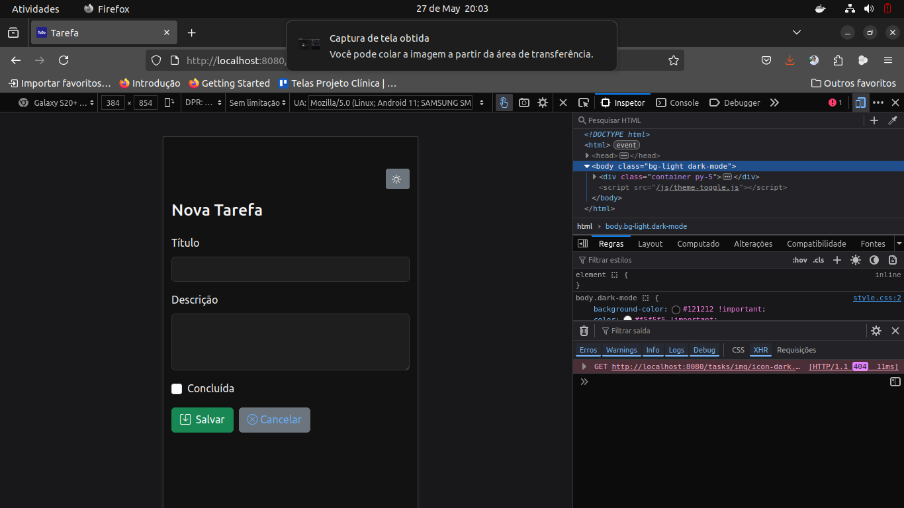


---

## 🧑‍💻 Como rodar o projeto localmente

### 1. Clone o repositório

```bash
git clone https://github.com/SEU_USUARIO/todolist.git
cd todolist
```

### 2. Configure o banco de dados

Crie um arquivo:
```bash
src/main/resources/application.properties
```

Com o conteúdo abaixo:
```properties
spring.datasource.url=jdbc:postgresql://localhost:5432/todolist
spring.datasource.username=seu_usuario
spring.datasource.password=sua_senha
spring.jpa.hibernate.ddl-auto=update
spring.jpa.show-sql=true
server.port=8080
```

### 3. Suba o PostgreSQL localmente (com Docker, por exemplo)
```bash
docker run --name todolist-db -e POSTGRES_PASSWORD=123456 -e POSTGRES_DB=todolist -p 5432:5432 -d postgres
```


### 4. Rode a aplicação
```bash
./mvnw spring-boot:run
```

Acesse: http://localhost:8080

## 🗂 Estrutura do Projeto

```css
src
├── main
│   ├── java/com/example/todolist
│   │   ├── controller
│   │   ├── entity
│   │   ├── repository
│   │   ├── service
│   │   └── config
│   ├── resources
│   │   ├── static
│   │   │   ├── css/style.css
│   │   │   ├── js/theme-toggle.js
│   │   │   ├── img/icon-light.png
│   │   │   ├── img/icon-dark.png
│   │   │   └── favicon.ico
│   │   ├── templates
│   │   │   ├── login.html
│   │   │   ├── register.html
│   │   │   ├── dashboard.html
│   │   │   ├── form-task.html
│   │   │   └── error.html
│   │   └── application.properties
```

## 🌙 Tema Escuro

- Alternável por botão

- Persistente com localStorage

- Ícones do sistema são trocados automaticamente


## 🧪 Teste Rápido
1. Cadastre-se

2. Faça login

3. Crie, edite e exclua tarefas

4. Use o botão "Tema Escuro" no topo da tela

5. Teste erros acessando uma URL inválida


## ✅ Checklist de implementação

- Setup do projeto

- Entidades + Repositórios

- Camada de serviços

- Controllers MVC

- Autenticação com Spring Security

- CRUD de tarefas com Thymeleaf

- Tema escuro manual

- Ícones e responsividade

- Página de erro customizada

- Versionamento com Git

## 📄 Licença

Este projeto é open-source e livre para uso pessoal e educacional.


🙌 Autor

Desenvolvido com 💻 e ☕ por [@RodrigoLee56](https://github.com/RodrigoLee56)

